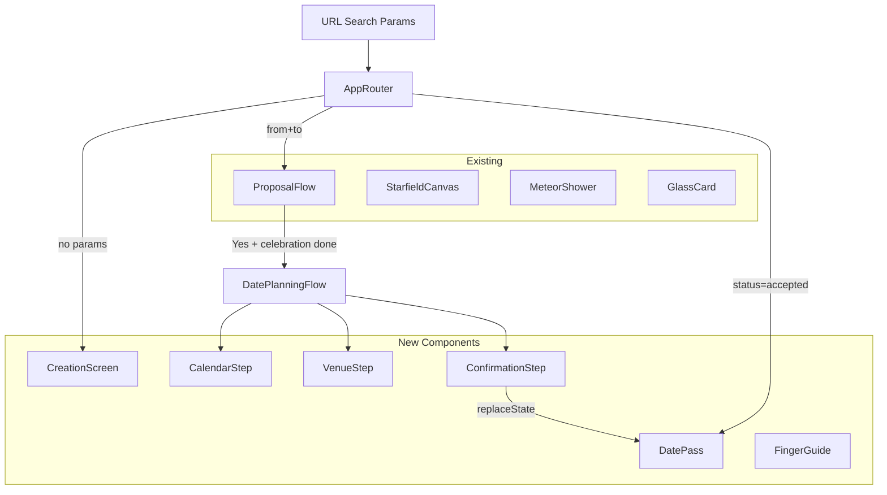
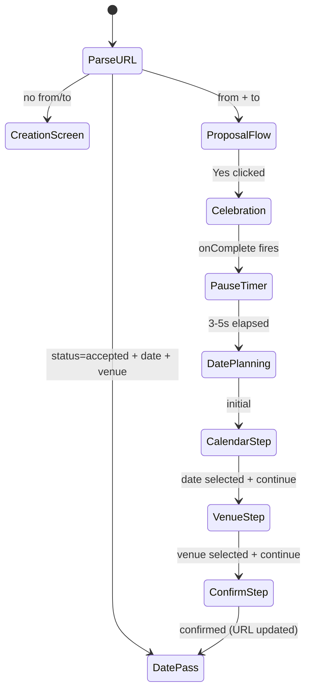

# Design Document: Dynamic Date Planning

## Overview

This feature extends the confession app with a post-acceptance date-planning flow and URL-parameter-based state management. The existing single-page app gains three new "screens" (Creation, Date Planning, Date Pass) determined entirely by URL search parameters — no router library required. The architecture preserves the existing proposal flow as a sub-component and layers new functionality on top.

Key design decisions:
- **URL-as-state**: All app state is derivable from URL search params, enabling shareable links and refresh persistence without a backend.
- **Emotional timing**: The celebration → intentional pause → surprise reveal sequence is managed via a simple state machine in the parent component.
- **No external dependencies**: Calendar is built from scratch; no routing or calendar library added.
- **Minimal existing code changes**: Current `App.tsx` logic moves into a `ProposalFlow` component; a new top-level `AppRouter` handles URL-based rendering.

## Architecture



### State Flow



## Components and Interfaces

### AppRouter (new top-level component)

Replaces the current `Page` export in `App.tsx`. Parses URL params on mount and renders the appropriate view.

```typescript
interface AppState {
  view: 'creation' | 'proposal' | 'date-pass';
  from?: string;
  to?: string;
  date?: string;   // ISO YYYY-MM-DD
  venue?: string;
}

function parseUrlParams(): AppState {
  const params = new URLSearchParams(window.location.search);
  const from = params.get('from');
  const to = params.get('to');
  const status = params.get('status');
  const date = params.get('date');
  const venue = params.get('venue');
  
  if (status === 'accepted' && from && to && date && venue && isValidDate(date)) {
    return { view: 'date-pass', from, to, date, venue };
  }
  if (from && to) {
    return { view: 'proposal', from, to };
  }
  return { view: 'creation' };
}
```

### CreationScreen

```typescript
interface CreationScreenProps {
  mode: DisplayMode;
}
// Renders two input fields (sender name, recipient name) + Generate Link button.
// On submit: constructs URL with encoded params, displays copyable link.
```

### ProposalFlow (refactored from current App.tsx Page component)

```typescript
interface ProposalFlowProps {
  from: string;
  to: string;
  mode: DisplayMode;
  onModeChange: (mode: DisplayMode) => void;
}
// Contains all existing logic: disclaimer, carousel, Yes/No, celebration.
// After celebration completes → triggers onDatePlanningReady callback after pause.
```

### DatePlanningFlow (orchestrates calendar → venue → confirm)

```typescript
interface DatePlanningFlowProps {
  from: string;
  to: string;
  mode: DisplayMode;
}

type PlanningStep = 'calendar' | 'venue' | 'confirm' | 'done';
```

### CalendarComponent

```typescript
interface CalendarProps {
  selectedDate: string | null;  // ISO format or null
  onDateSelect: (isoDate: string) => void;
  onInteraction: () => void;    // signals first interaction (for finger guide)
}
```

### FingerGuide

```typescript
interface FingerGuideProps {
  visible: boolean;
  targetRef: React.RefObject<HTMLElement>;
}
// Renders animated pointing emoji near the calendar. 
// Disappears when visible becomes false.
```

### VenueSelector

```typescript
interface VenueSelectorProps {
  selectedVenue: string | null;
  onVenueSelect: (venue: string) => void;
  onContinue: () => void;
}

const PRESET_VENUES = [
  'Marina Bay',
  'Gardens by the Bay',
  'Jewel Changi Airport',
  'Sentosa',
] as const;
```

### ConfirmationScreen

```typescript
interface ConfirmationScreenProps {
  from: string;
  to: string;
  date: string;   // ISO
  venue: string;
  onConfirm: () => void;
}
```

### DatePass

```typescript
interface DatePassProps {
  from: string;
  to: string;
  date: string;   // ISO
  venue: string;
  mode: DisplayMode;
}
// Renders polished ticket card with names, date, venue, badge.
// Includes copy link + share button.
```

## Data Models

### URL Parameter Schema

| Parameter | Type | Required For | Format |
|-----------|------|--------------|--------|
| `from` | string | proposal, accepted | URL-encoded name |
| `to` | string | proposal, accepted | URL-encoded name |
| `status` | string | accepted | literal "accepted" |
| `date` | string | accepted | ISO 8601 YYYY-MM-DD |
| `venue` | string | accepted | URL-encoded venue name |

### Internal State Types

```typescript
// Calendar grid model
interface CalendarMonth {
  year: number;
  month: number;  // 0-indexed (JS Date convention)
  days: CalendarDay[];
}

interface CalendarDay {
  date: number;       // day of month (1-31)
  iso: string;        // YYYY-MM-DD
  isToday: boolean;
  isPast: boolean;
  isSelected: boolean;
  dayOfWeek: number;  // 0=Sun, 6=Sat
}

// Date formatting utilities
function formatDateHuman(iso: string, locale?: string): string;
// → "Sunday, 30 August 2026"

function isValidIsoDate(str: string): boolean;
// → true if matches YYYY-MM-DD and represents a real date

function getDaysInMonth(year: number, month: number): number;
// → 28-31
```

### i18n Extension

New keys added to `Translation` interface:

```typescript
interface Translation {
  // ... existing keys ...
  
  // Creation screen
  creationTitle: string;
  senderNameLabel: string;
  recipientNameLabel: string;
  generateLink: string;
  linkCopied: string;
  copyLink: string;
  
  // Calendar
  calendarTitle: string;
  monthNames: string[];      // 12 month names
  dayHeaders: string[];      // 7 day abbreviations (Sun-Sat)
  selectedDateLabel: string; // "Selected: {date}"
  
  // Venue
  venueTitle: string;
  customVenueLabel: string;
  customVenuePlaceholder: string;
  
  // Confirmation
  confirmTitle: string;
  confirmDate: string;
  confirmVenue: string;
  confirmButton: string;
  
  // Date Pass
  datePassTitle: string;
  dateConfirmedBadge: string;
  shareButton: string;
}
```

## Correctness Properties

*A property is a characteristic or behavior that should hold true across all valid executions of a system — essentially, a formal statement about what the system should do. Properties serve as the bridge between human-readable specifications and machine-verifiable correctness guarantees.*

### Property 1: URL Parameter Round-Trip

*For any* pair of non-empty name strings (from, to), generating a proposal URL from those names and then parsing the URL parameters back SHALL produce the original name values.

**Validates: Requirements 1.2, 2.1, 2.5**

### Property 2: Whitespace Name Rejection

*For any* string composed entirely of whitespace characters (spaces, tabs, newlines), the name validation function SHALL reject it as invalid, preventing submission.

**Validates: Requirements 1.3**

### Property 3: Name Substitution Completeness

*For any* non-empty name string used as the sender name, substituting it into dialogue templates SHALL produce output containing that name and no remaining placeholder tokens.

**Validates: Requirements 3.1**

### Property 4: Calendar Day Count Accuracy

*For any* valid year (2000-2100) and month (0-11), the calendar grid generation function SHALL produce exactly the number of days that exist in that month (accounting for leap years).

**Validates: Requirements 6.1**

### Property 5: Past Date Rejection

*For any* date strictly before today, attempting to select it in the calendar SHALL leave the selected date unchanged (selection is a no-op for past dates).

**Validates: Requirements 6.5**

### Property 6: Future/Today Date Selection

*For any* date that is today or in the future, selecting it SHALL result in that date becoming the selected value.

**Validates: Requirements 6.4**

### Property 7: Date Format Round-Trip

*For any* valid Date object, converting to ISO format (YYYY-MM-DD) and then parsing back to a Date SHALL produce the same year, month, and day values.

**Validates: Requirements 6.7, 6.8**

### Property 8: Confirmation URL Construction

*For any* valid combination of from-name, to-name, ISO date, and venue string, constructing the confirmation URL and parsing it back SHALL yield the original four values.

**Validates: Requirements 8.2, 2.5**

### Property 9: Venue Validation — Continue Button State

*For any* venue selection state, the Continue button SHALL be enabled if and only if a non-empty venue string is selected (either a preset choice or non-whitespace custom text).

**Validates: Requirements 7.4**

### Property 10: Past Month Navigation Disabled

*For any* month that is before the current month, the calendar navigation SHALL prevent navigating to that month (previous button disabled when at current month).

**Validates: Requirements 6.3**

## Error Handling

| Scenario | Behavior |
|----------|----------|
| Missing `to` param with `from` present | Render CreationScreen |
| `status=accepted` with missing `date` or `venue` | Render CreationScreen |
| Invalid `date` param (not YYYY-MM-DD or invalid date) | Render CreationScreen |
| Clipboard API unavailable | Show fallback "select and copy" text |
| Web Share API unavailable | Hide Share button, keep Copy button |
| Empty/whitespace name submission | Prevent form submission, show validation |
| URL with unrecognized params | Ignore extra params, route normally |

All error paths are handled silently (no error dialogs, no console errors in production). The app always renders a usable screen.

## Testing Strategy

### Property-Based Tests (fast-check)

The project already uses `fast-check` with Vitest. Each correctness property maps to one property-based test with 100+ iterations:

- **URL round-trip** (Property 1, 8): Generate arbitrary strings with unicode/special chars, verify encode→decode identity
- **Whitespace rejection** (Property 2): Generate whitespace-only strings of varying length, verify rejection
- **Name substitution** (Property 3): Generate arbitrary name strings, verify template output
- **Calendar grid** (Property 4): Generate year/month pairs, verify day count matches `new Date(year, month+1, 0).getDate()`
- **Date selection rules** (Property 5, 6): Generate dates before/after today, verify select behavior
- **Date formatting** (Property 7): Generate valid dates, verify ISO round-trip
- **Venue validation** (Property 9): Generate venue states (null, preset, empty-custom, filled-custom), verify button state
- **Month navigation** (Property 10): Generate months relative to current, verify disable state

### Unit Tests (Vitest + Testing Library)

- Component rendering tests for each new component
- Integration tests for the full flow (creation → proposal → planning → pass)
- Edge case tests for error handling (invalid URLs, missing params)
- Interaction tests (click calendar date, select venue, copy link)

### Test File Organization

```
src/
  utils/
    __tests__/
      urlParams.property.test.ts      # Properties 1, 2, 8
      calendarUtils.property.test.ts  # Properties 4, 5, 6, 7, 10
      venueValidation.property.test.ts # Property 9
      nameSubstitution.property.test.ts # Property 3
  components/
    __tests__/
      CreationScreen.test.tsx
      CalendarComponent.test.tsx
      VenueSelector.test.tsx
      DatePass.test.tsx
      ConfirmationScreen.test.tsx
  __tests__/
    App.integration.test.tsx  # existing + new routing tests
```

### Test Configuration

- Property tests: minimum 100 iterations per property (`{ numRuns: 100 }`)
- Each property test tagged: `Feature: dynamic-date-planning, Property N: {title}`
- Tests run via `vitest run` (non-watch mode)
